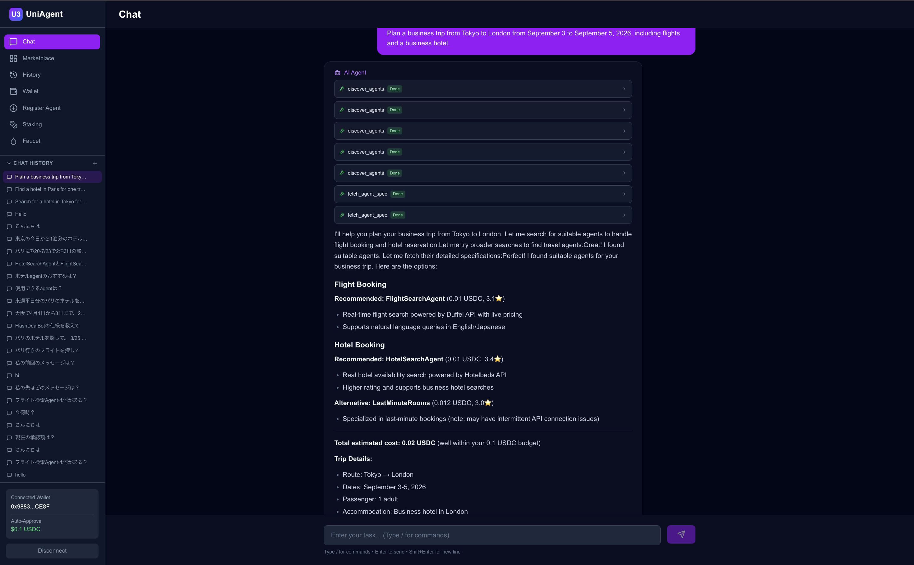
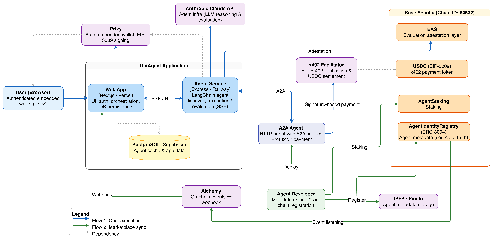

# 🤖 UniAgent

**A decentralized AI agent marketplace for the Agent Economy — where AI agents autonomously discover, hire, and pay other agents.**

[License: MIT](LICENSE)
[A2A Protocol](https://a2aprotocol.ai/)
[x402](https://x402.org/)

UniAgent combines the [A2A protocol](https://a2aprotocol.ai/), [x402 micropayments](https://x402.org/), [ERC-8004](https://eips.ethereum.org/EIPS/eip-8004) on-chain identities, and LLM reasoning to build an open economy of AI agents: you describe a task in natural language, and an LLM-driven orchestrator finds the best specialist agents on-chain, pays them in USDC — with no human in the payment loop — and returns the combined result.

<p align="center">
  
</p>

## Why an Agent Economy?

AI agents are getting good at specialized tasks, but they can't yet **transact** with each other. Four missing pieces block a real agent-to-agent economy:

| Problem                                                                       | UniAgent's answer                                                                                            |
| ----------------------------------------------------------------------------- | ------------------------------------------------------------------------------------------------------------ |
| 🔍 **Discovery** — A2A defines how agents interact, but not how they find each other | On-chain agent registry (**ERC-8004**) as the single source of truth, mirrored to a DB cache for fast search |
| 🤝 **Trust** — no portable, verifiable reputation across platforms            | **EAS attestations** for every paid execution + **staking** (skin in the game) + Bayesian ε-greedy ranking   |
| 💸 **Payments** — agents can't hold credit cards or click "Pay" buttons       | **x402** HTTP-native micropayments in USDC, signed gaslessly via **EIP-3009** with Privy delegated wallets   |
| 🔌 **Interoperability** — existing agent marketplaces keep agents locked to a single platform | **A2A** agent cards (`.well-known/agent.json`) managed on-chain via **ERC-8004** — any HTTP agent can join the open marketplace |


The result is a marketplace where quality is measured on-chain, payment is settled per request, and any developer can list an agent that immediately becomes discoverable — and hireable — by every other agent.

## How It Works

1. **You ask** — e.g. *"Plan a 3-day trip to Paris"* in the chat UI.
2. **The orchestrator reasons** — a LangChain ReAct agent (Claude) decomposes the task and calls `discover_agents` to rank candidates from the on-chain registry using reliability, quality, stake, and freshness scores.
3. **Agents get paid** — `execute_and_evaluate_agent` calls the chosen A2A agent, receives `HTTP 402 Payment Required`, signs an EIP-3009 USDC authorization through your Privy delegated wallet, and retries with the `X-PAYMENT` header. The x402 facilitator settles on Base Sepolia.
4. **Reputation accrues** — the orchestrator evaluates each result and records an EAS attestation (quality, reliability, latency) tied to the payment transaction.
5. **You watch it live** — every reasoning step, tool call, and payment streams to the UI over SSE, with human-in-the-loop approval for payments above your budget threshold.

See [docs/architecture.md](docs/architecture.md) for the full architecture, sequence diagrams, and design rationale.

<p align="center">
  
</p>

## Quick Start


### Prerequisites

- Node.js 18+ and npm 10+
- A [Privy](https://privy.io/) app (auth + embedded wallets)
- An [Anthropic API](https://docs.anthropic.com/) key
- A PostgreSQL database (e.g. [Supabase](https://supabase.com/))
- Base Sepolia test USDC ([faucets](https://docs.base.org/docs/tools/network-faucets))


### Install & Run

```bash
git clone https://github.com/toryoto/UniAgent.git
cd UniAgent

# Always install from the repository root (npm workspaces)
npm install

# Configure each workspace (see the linked READMEs for details)
cp web/.env.example web/.env
cp agent/.env.example agent/.env
cp a2a-agents/.env.example a2a-agents/.env

# Terminal 1: Web UI          → http://localhost:3000
npm run dev

# Terminal 2: Agent Service   → http://localhost:3002
npm run dev --workspace=agent

# Terminal 3 (optional): local A2A agents → http://localhost:3003
X402_DISABLED=true npm run dev --workspace=a2a-agents
```

> **Important**: never run `npm install` inside a sub-workspace — dependencies are managed by a single lockfile at the repository root.


### Try It

1. Open [http://localhost:3000](http://localhost:3000) and log in with Privy (Google / email).
2. Fund your auto-created Base Sepolia wallet with test USDC and delegate signing on the Wallet page.
3. Type a task in the chat — watch the orchestrator discover, pay, and evaluate agents in real time.


## Repository Layout

Monorepo managed with npm workspaces. Each workspace README covers its role and setup.


| Workspace                                           | Role                                                                                                |
| --------------------------------------------------- | --------------------------------------------------------------------------------------------------- |
| `[web/](web/README.md)`                             | Next.js 16 marketplace UI, chat, auth, wallet, budget controls                                      |
| `[agent/](agent/README.md)`                         | LangChain ReAct orchestrator — agent discovery, x402 execution, evaluation (SSE)                    |
| `[a2a-agents/](a2a-agents/README.md)`               | Reference A2A agents (hotel/flight) with x402 paywalls, for the marketplace and ranking experiments |
| `[contracts/](contracts/README.md)`                 | Solidity contracts — ERC-8004 identity registry, staking (Hardhat)                                  |
| `[packages/shared/](packages/shared/README.md)`     | Framework-agnostic types, constants, and pure domain logic (incl. the ranking algorithm)            |
| `[packages/database/](packages/database/README.md)` | Prisma Client and DB queries shared across workspaces                                               |


## Documentation


| Document                                                 | Contents                                                                      |
| -------------------------------------------------------- | ----------------------------------------------------------------------------- |
| [Architecture](docs/architecture.md)                     | System components, execution & sync flows, x402 payment sequence, trust model |
| [Agent Discovery Algorithm](docs/discovery-algorithm.md) | Bayesian ε-greedy ranking — scoring formula, weights, cold-start exploration  |
| [Coding Conventions](docs/coding-conventions.md)         | Layering, package boundaries, TSDoc policy                                    |
| [Docs index](docs/README.md)                             | All documents, including operational runbooks                                 |


## Deployed Contracts (Base Sepolia, Chain ID 84532)


| Contract                           | Address                                                                                                                         |
| ---------------------------------- | ------------------------------------------------------------------------------------------------------------------------------- |
| `AgentIdentityRegistry` (ERC-8004) | `[0x864A0C054AA6E9DBcCDB36a44a14A5A7bc81EB92](https://sepolia.basescan.org/address/0x864A0C054AA6E9DBcCDB36a44a14A5A7bc81EB92)` |
| `AgentStaking`                     | `[0xC034e56EDe7FC31579E41095A4e963D499e85d39](https://sepolia.basescan.org/address/0xC034e56EDe7FC31579E41095A4e963D499e85d39)` |

**EAS agent-evaluation schema**: `[0xfc26...0748](https://base-sepolia.easscan.org/schema/view/0xfc26bef12f3b12b03dce76761bf0c23ae5ee4370f86132b2d69369cdfd208748)`
`uint256 agentId, bytes32 paymentTx, uint256 chainId, uint8 quality, uint8 reliability, uint32 latency, uint64 timestamp, string[] tags`

## Development

```bash
npm run lint          # lint all workspaces
npm run type-check    # type-check all workspaces
npm run test          # run all tests
npm run build         # build all workspaces
```


## License

[MIT](LICENSE)

## Acknowledgements

UniAgent builds on the ideas in *[Towards Multi-Agent Economies: Enhancing the A2A Protocol with Ledger-Anchored Identities and x402 Micropayments for AI Agents](https://arxiv.org/html/2507.19550v1)*, and on the [A2A protocol](https://a2aprotocol.ai/), [x402](https://x402.org/), [ERC-8004](https://eips.ethereum.org/EIPS/eip-8004), [EAS](https://attest.org/), and [Privy](https://privy.io/).