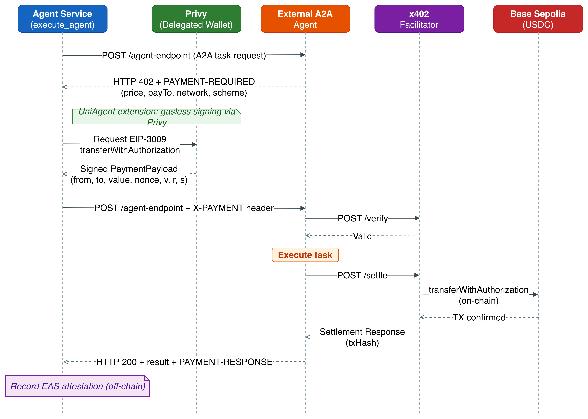

# UniAgent Architecture

This document describes the system architecture of UniAgent: the components, the two main runtime flows (chat execution and marketplace sync), the x402 payment sequence, and the trust model that makes an open agent marketplace viable.

## System Overview


UniAgent is a monorepo with two deployable applications (Web App, Agent Service), a set of reference A2A agents, smart contracts on Base Sepolia, and shared packages.

| Component                      | Technology                                                    | Responsibility                                                                                 |
| ------------------------------ | ------------------------------------------------------------- | ---------------------------------------------------------------------------------------------- |
| **Web App** (`web/`)           | Next.js 16 / React 19, deployed on Vercel                     | UI, Privy auth, orchestration of API routes, conversation & budget persistence                 |
| **Agent Service** (`agent/`)   | Express + LangChain ReAct agent (Claude), deployed on Railway | Task decomposition, agent discovery, x402-paid execution, result evaluation, SSE streaming     |
| **A2A Agents** (`a2a-agents/`) | Express, x402 middleware                                      | External HTTP agents exposing `.well-known/agent.json`; hotel/flight reference implementations |
| **Contracts** (`contracts/`)   | Solidity / Hardhat, Base Sepolia                              | `AgentIdentityRegistry` (ERC-8004), `AgentStaking`                                             |
| **PostgreSQL** (Supabase)      | Prisma                                                        | Agent cache (mirror of on-chain registry), conversations, budgets, attestation cache           |
| **Privy**                      | External SaaS                                                 | Social login, embedded wallets, delegated EIP-3009 signing                                     |
| **x402 Facilitator**           | External service                                              | Verifies payment payloads and settles USDC transfers on-chain                                  |
| **EAS**                        | Base Sepolia                                                  | Off-chain attestations (quality / reliability / latency) anchored to payment transactions      |
| **IPFS (Pinata)**              | External SaaS                                                 | Immutable agent metadata referenced by the registry's tokenURI                                 |
| **Alchemy Webhook**            | External SaaS                                                 | Pushes on-chain registry events to the Web App for DB sync                                     |

### Dependency direction inside the monorepo

```text
packages/shared    (no DB, no framework — types, constants, pure functions)
      ↓
packages/database  (Prisma Client + queries shared by web and agent)
      ↓
web / agent / a2a-agents / contracts
```

Layering within an app: `Route/UI → lib (orchestration) → shared (domain) → db / external I/O`. See [coding-conventions.md](coding-conventions.md) for the full rules.

## Flow 1: Chat Execution

The blue path in the diagram above — what happens when a user submits a task.

1. **Request** — the user types a task in the chat UI. The Next.js API route authenticates the Privy token, loads the user's `autoApproveThreshold` from `BudgetSettings` in the DB (client-supplied values are never trusted), and proxies to the Agent Service.
2. **Reasoning loop** — the LangChain ReAct agent iterates with three tools:
   - `discover_agents` — queries the agent cache and returns the top 3 candidates ranked by the [Bayesian ε-greedy algorithm](discovery-algorithm.md) (reliability, quality, stake, freshness + cold-start exploration slot).
   - `fetch_agent_spec` — fetches `.well-known/agent.json` / OpenAPI to inspect the endpoint, input schema, price, and payment receiver before committing to a paid call.
   - `execute_and_evaluate_agent` — performs the x402-paid execution (next section) and evaluates the result.
3. **Human-in-the-loop** — if the quoted price exceeds the user's auto-approve threshold, the run pauses and the Web App asks the user to approve or reject; `POST /api/agent/resume` continues the run.
4. **Streaming** — every step is streamed to the browser over SSE. The event vocabulary the UI relies on: `start`, `log`, `content`, `tool_call`, `payment`, `end`, `error`.
5. **Evaluation** — after each paid execution, the LLM scores the response and the Agent Service records an EAS attestation (off-chain, signed) referencing the payment transaction hash, closing the reputation loop.

## Flow 2: Marketplace Sync

The green path — how agents get listed and how the marketplace stays consistent.

1. An agent developer uploads agent metadata to IPFS via Pinata and registers on `AgentIdentityRegistry` (ERC-8004, ERC-721-based; the tokenURI points at the IPFS metadata). Mutable data — price, endpoint — lives in the agent's `.well-known/agent.json`, not in immutable IPFS metadata.
2. Optionally the developer stakes USDC in `AgentStaking` — stake feeds the deposit term of the ranking score (skin in the game).
3. Alchemy watches registry events and calls a webhook on the Web App, which syncs the on-chain state into the `agent_cache` table.
4. The marketplace UI and `discover_agents` both read from this cache, with **the blockchain as the single source of truth** — the DB is a queryable mirror, never the authority.

## x402 Payment Sequence



The x402 protocol turns HTTP 402 into a machine-payable flow. UniAgent's extension is **gasless signing via Privy delegated wallets** — the user's embedded wallet signs EIP-3009 `transferWithAuthorization` payloads server-side, under a delegation the user granted once, so no wallet popup interrupts the agent loop.

1. Agent Service POSTs the A2A task to the external agent's endpoint.
2. The agent responds `402 Payment Required` with payment requirements (price, `payTo`, network, scheme).
3. Agent Service requests an EIP-3009 `transferWithAuthorization` signature from Privy for the user's delegated wallet.
4. The request is retried with the signed payload in the `X-PAYMENT` header.
5. The agent verifies the payload with the x402 facilitator, executes the task, then asks the facilitator to settle — the facilitator submits `transferWithAuthorization` on-chain (Base Sepolia USDC).
6. The agent returns `200` with the result and a `PAYMENT-RESPONSE` header containing the settlement transaction hash.
7. Agent Service records an EAS attestation referencing that transaction hash.

Because the payer only signs an authorization (not a transaction), the payment is gasless for the user and atomic from the agent's perspective: no valid payment, no work.

## Trust Model

An open marketplace invites low-quality and adversarial agents. UniAgent layers three defenses:

1. **Verifiable identity** — every agent is an ERC-8004 token with immutable IPFS metadata; ownership and history are public.
2. **Earned reputation** — attestations are only recorded for _paid_ executions and reference the payment transaction, so reviews cost money to fabricate. Bayesian averaging (prior strength C=3) blunts the effect of a handful of self-reviews.
3. **Economic stake** — the log-scaled deposit term rewards staked agents but caps at 500 USDC, so capital alone cannot dominate ranking; misbehavior puts the stake at risk.

The scoring formula, weights, and cold-start exploration mechanics are specified in [discovery-algorithm.md](discovery-algorithm.md).

## Security Boundaries

- **`autoApproveThreshold`** is loaded server-side from the DB on every run; the value sent by the client is ignored.
- **Prisma access** is confined to `web/src/lib/db/` (web-specific) and `packages/database/` (shared). UI components and API routes never import Prisma directly.
- **Secrets** (Privy authorization key, EAS signer key, DB URL) exist only in server-side environments; `NEXT_PUBLIC_*` variables are treated as public.
- **External agent responses** are untrusted input: parsed, schema-narrowed, and evaluated before being surfaced to the user.

## Deployed Contracts (Base Sepolia, Chain ID 84532)

| Contract                           | Address                                      |
| ---------------------------------- | -------------------------------------------- |
| `AgentIdentityRegistry` (ERC-8004) | `0x864A0C054AA6E9DBcCDB36a44a14A5A7bc81EB92` |
| `AgentStaking`                     | `0xC034e56EDe7FC31579E41095A4e963D499e85d39` |

EAS agent-evaluation schema UID: `0xfc26bef12f3b12b03dce76761bf0c23ae5ee4370f86132b2d69369cdfd208748` ([view](https://base-sepolia.easscan.org/schema/view/0xfc26bef12f3b12b03dce76761bf0c23ae5ee4370f86132b2d69369cdfd208748))
