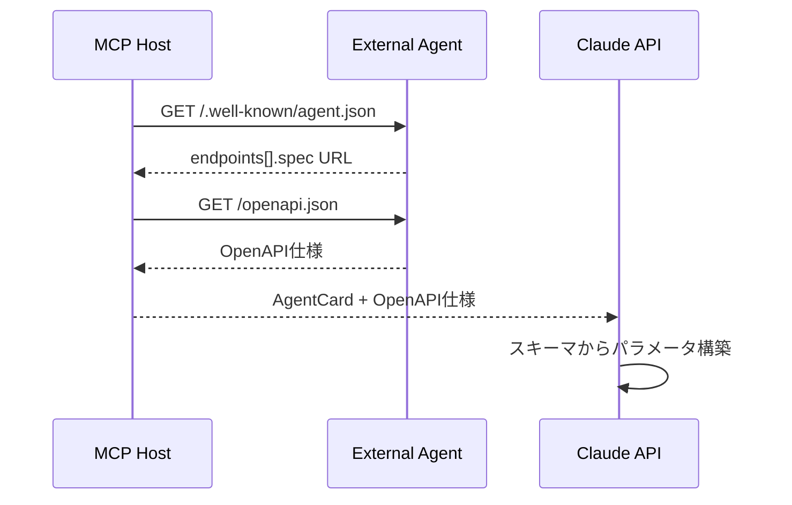

# agent.json 設計仕様

## 目的

A2A標準に準拠した `.well-known/agent.json` の設計指針を定義する。

## 設計原則

### Source of Truth

**オンチェーン（AgentRegistry）= 唯一の信頼できる情報源**

- メタデータ（name, description, skills, price, rating等）は**すべてオンチェーンを参照**
- agent.jsonは**API接続情報のみ**を提供
- 重複するメタデータがagent.jsonに含まれていても**無視する**

### 理由

1. **スマートコントラクトエコシステムへの参加**: 他のコントラクトから参照可能にするため、メタデータはオンチェーン必須
2. **改ざん防止**: ブロックチェーンの不変性により、評価・価格情報の信頼性を担保
3. **一貫性**: 単一のSource of Truthにより、データの不整合を防止

## 役割分担

| 情報種別                        | オンチェーン（AgentRegistry） | agent.json              |
| ------------------------------- | ----------------------------- | ----------------------- |
| メタデータ（name, description） | ✅ Source of Truth            | ❌ 無視                 |
| スキル（skills）                | ✅ Source of Truth            | ❌ 無視                 |
| 価格（price）                   | ✅ Source of Truth            | ❌ 無視                 |
| 評価（rating）                  | ✅ Source of Truth            | ❌ 無視                 |
| **A2Aエンドポイント**           | ❌                            | ✅ **agent.jsonで提供** |
| **OpenAPI仕様**                 | ❌                            | ✅ **agent.jsonで提供** |

## agent.json 仕様

### 最小構成

```json
{
  "//": "メタデータはブロックチェーン(AgentRegistry)を参照してください",
  "agent_id": "0x1234...",
  "endpoints": [
    {
      "url": "https://api.example.com/chat",
      "spec": "https://api.example.com/openapi.json"
    }
  ]
}
```

### フィールド定義

| フィールド         | 型     | 必須 | 説明                                                      |
| ------------------ | ------ | ---- | --------------------------------------------------------- |
| `agent_id`         | string | ✅   | オンチェーンのagentIdとの紐付け確認用（bytes32のhex表現） |
| `endpoints`        | array  | ✅   | A2Aエンドポイント情報の配列                               |
| `endpoints[].url`  | string | ✅   | A2A JSON-RPCエンドポイントURL                             |
| `endpoints[].spec` | string | ✅   | OpenAPI仕様のURL                                          |

### 複数エンドポイント（将来拡張）

```json
{
  "agent_id": "0x1234...",
  "endpoints": [
    {
      "url": "https://api.example.com/chat",
      "spec": "https://api.example.com/openapi.json"
    },
    {
      "url": "https://api-eu.example.com/chat",
      "spec": "https://api-eu.example.com/openapi.json"
    }
  ]
}
```

PoCでは最初のエンドポイントのみ使用。

## OpenAPI 仕様

### 役割

- **APIスキーマの詳細定義**: パラメータ型、バリデーション、例
- **LLMが実行時にパラメータを構築**: Claude APIがOpenAPI仕様を参照して適切なリクエストを生成

### 参照タイミング



### OpenAPI 例

```yaml
openapi: 3.0.0
info:
  title: Flight Finder API
  version: 1.0.0
paths:
  /search:
    post:
      summary: Search flights
      requestBody:
        required: true
        content:
          application/json:
            schema:
              type: object
              properties:
                origin:
                  type: string
                  description: Departure airport code
                  example: 'NRT'
                destination:
                  type: string
                  description: Arrival airport code
                  example: 'CDG'
                date:
                  type: string
                  format: date
                  example: '2025-06-15'
                passengers:
                  type: integer
                  minimum: 1
                  example: 2
              required:
                - origin
                - destination
                - date
```

## 実装ガイドライン

### エージェント提供者

1. **オンチェーン登録**: AgentRegistry.registerAgent()でメタデータ・価格・Base URLを登録
2. **agent.json配置**: `https://<base-url>/.well-known/agent.json` にファイルを配置
3. **OpenAPI仕様提供**: `endpoints[].spec` のURLでOpenAPI仕様を公開
4. **メタデータ同期不要**: agent.jsonにname, skills等を書く必要なし

### MCP Host（discover_agents実装）

```typescript
// 1. オンチェーンからAgentCard取得（メタデータ、価格）
const agent = await registry.getAgentCard(agentId);

// 2. agent.jsonからエンドポイント情報取得
const agentJson = await fetch(`${agent.url}/.well-known/agent.json`).then((r) => r.json());

// 3. OpenAPI仕様取得
const openApiSpec = await fetch(agentJson.endpoints[0].spec).then((r) => r.json());

// 4. 統合して返却（オンチェーンがベース）
return {
  ...agent, // オンチェーンのメタデータを優先
  endpoint: agentJson.endpoints[0].url,
  openapi: openApiSpec,
};
```

### 検証ルール

```typescript
// agent_idの一致確認
if (agentJson.agent_id !== agent.agentId) {
  console.warn('Agent ID mismatch');
  // オンチェーンを信頼
}

// メタデータが含まれていても無視
// agent.json内のname, skills, priceは使用しない
```

## エラーハンドリング

### agent.json取得失敗

```typescript
try {
  const agentJson = await fetch(`${agent.url}/.well-known/agent.json`);
} catch (error) {
  // フォールバック: オンチェーンのBase URLをエンドポイントとして使用
  return {
    ...agent,
    endpoint: `${agent.url}/api/v1/agent`,
    openapi: null,
  };
}
```

### OpenAPI仕様取得失敗

```typescript
try {
  const openApiSpec = await fetch(agentJson.endpoints[0].spec);
} catch (error) {
  // Graceful degradation: スキーマなしで継続
  // Claude APIは自然言語でパラメータを推測
  return {
    ...agent,
    endpoint: agentJson.endpoints[0].url,
    openapi: null,
  };
}
```

## サンプルエージェント構成例

### ディレクトリ構造

```
flight-agent/
├── .well-known/
│   └── agent.json          # エンドポイント情報のみ
├── openapi.json            # API仕様
└── api/
    └── v1/
        └── agent/          # A2Aエンドポイント
```

### agent.json

```json
{
  "agent_id": "0x0bddd164b1ba44c2b7bd2960cce576de2de93bd1da0b5621d6b8ffcffa91b75e",
  "endpoints": [
    {
      "url": "https://flight-agent.example.com/api/v1/agent",
      "spec": "https://flight-agent.example.com/openapi.json"
    }
  ]
}
```

### オンチェーン登録

```typescript
await agentRegistry.registerAgent(
  '0x0bddd164b1ba44c2b7bd2960cce576de2de93bd1da0b5621d6b8ffcffa91b75e',
  'FlightFinderPro', // name
  '最安値フライト検索エージェント', // description
  'https://flight-agent.example.com', // Base URL
  '1.0.0', // version
  ['text/plain'], // defaultInputModes
  ['application/json'], // defaultOutputModes
  [{ id: 'search', name: 'Search', description: '...' }], // skills
  { tokenAddress, receiverAddress, pricePerCall: 10000, chain: 'sepolia' },
  'travel', // category
  'https://example.com/image.png' // imageUrl
);
```

## まとめ

- **オンチェーン = メタデータのSource of Truth**
- **agent.json = エンドポイント情報のみ**
- **OpenAPI = APIスキーマの詳細定義**
- メタデータの重複は許容するが、**オンチェーンを常に優先**
