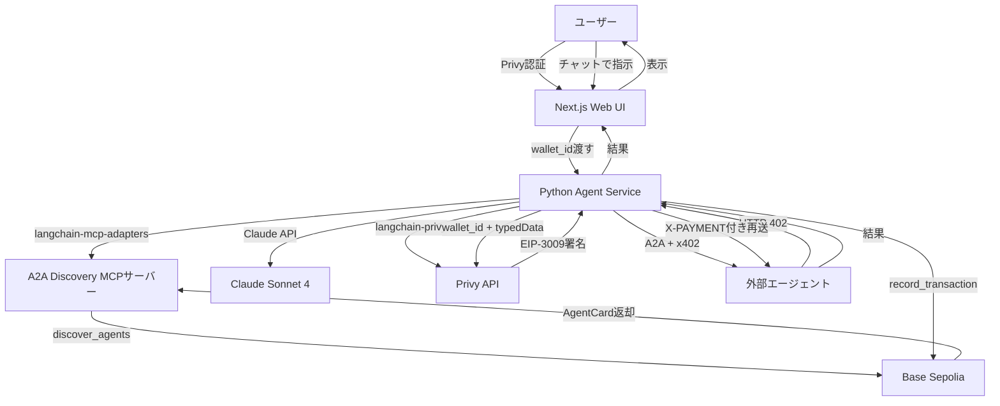
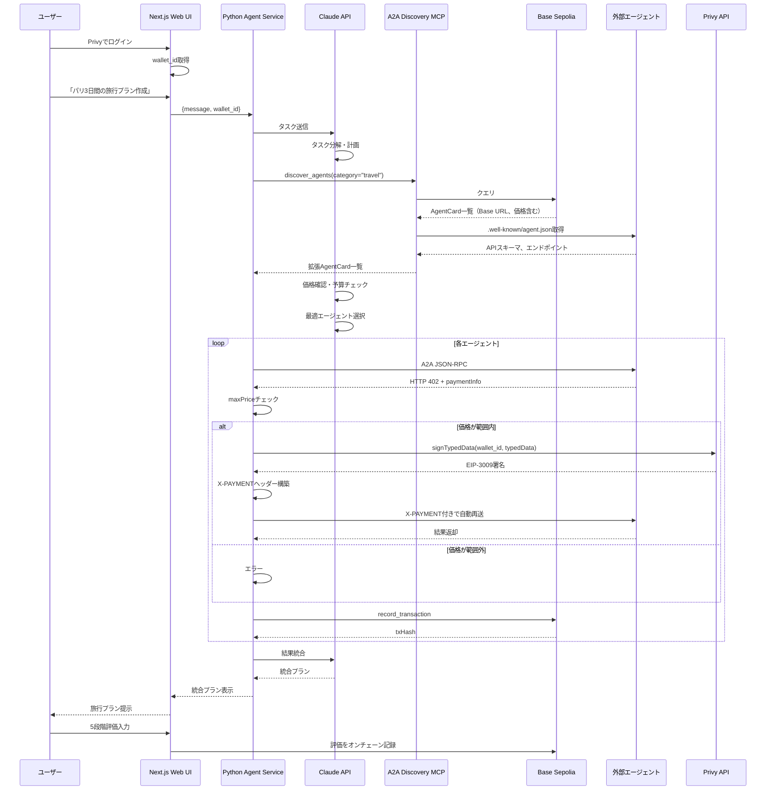
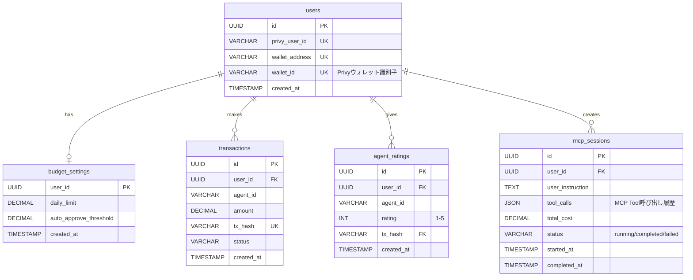

アイデアのもと:https://arxiv.org/html/2507.19550v1

## 1. プロダクト概要

### 1.1 目的

A2A、x402、ブロックチェーンを融合した AI エージェント向け分散型マーケットプレイス。エージェントが自律的に他のエージェントを発見・利用・決済できるエコシステムを実現する。

### 1.2 コアバリュー

- **Discovery（発見）**: オンチェーンでエージェントを検索・発見
- **Trust（信頼）**: ブロックチェーンベースの評価システム
- **Automation（自動化）**: x402 による人間介入不要の決済
- **Openness（開放性）**: フレームワーク非依存の標準準拠

---

## 2. システム構成

### 2.1 技術スタック

| レイヤー         | 技術                                      | 役割                    |
| ---------------- | ----------------------------------------- | ----------------------- |
| ブロックチェーン | Solidity, Base Sepolia                    | レジストリ、評価管理    |
| エージェント実行 | Python, Claude API, LangChain             | ユーザーエージェント    |
| エージェント統合 | langchain-mcp-adapters, langchain-privy   | MCP統合、ウォレット操作 |
| バックエンド     | Next.js, Privy SDK (@privy-io/react-auth) | UI、ウォレット管理      |
| 決済             | Coinbase x402 v1, USDC (Base Sepolia)     | 自動マイクロペイメント  |
| MCP              | A2A Discovery MCPサーバー (既存)          | エージェント発見        |

### 2.2 アーキテクチャ



### 2.3 LLM と Python Agent Service の責務分離

**LLM（Claude API）の役割**:

- タスク分解と計画立案
- 利用するエージェントの選択
- **価格情報に基づく決済判断（maxPrice設定）**
- ユーザー予算との整合性確認

**Python Agent Service の責務**:

- langchain-mcp-adapters: MCPサーバーとの通信、`discover_agents` ツール取得
- langchain-privy: wallet_id使用、Privy API経由でEIP-3009署名取得
- x402決済プロトコルの実行（X-PAYMENTヘッダー構築）
- **maxPrice範囲内での自動決済**
- 決済後の自動再送
- Base Sepoliaへのオンチェーン記録

**重要原則**: Claude は `discover_agents` で取得した価格情報を基に決済の可否を判断し、`maxPrice` パラメータで許容上限を設定する。Python Agent Service は HTTP 402 受信時に `maxPrice` と実際の請求額を比較し、範囲内であれば langchain-privy で署名取得、x402決済・再送を実行する。Claude は x402 プロトコルの詳細（EIP-3009署名作成・再送ロジック）を認識せず、決済の「判断」のみを担当する。

---

## 3. 主要機能

### 3.1 ユーザー認証・ウォレット管理

**概要**: Privy によるソーシャルログインとBase Sepoliaウォレット自動作成

**機能**:

- ソーシャルログイン（Google、Email）
- Base Sepoliaウォレット自動作成（秘密鍵は Privy 管理）
- wallet_id取得（Python Agent Serviceに渡す）
- USDC (Base Sepolia) 入金・approve実行
- 予算上限設定

**画面**:

- ログイン画面
- ウォレット作成・入金画面
- 予算設定画面

---

### 3.2 ユーザーエージェント（Python Agent Service）

**概要**: Python Agent ServiceがClaude API、langchain-mcp-adapters、langchain-privyを統合してエージェントとして機能

**実装方式**:

- **エージェント本体**: Claude API（推論・判断・タスク計画・価格判断）
- **実行基盤**: Python + LangChain
  - langchain-mcp-adapters: MCPサーバー統合（`discover_agents`ツール取得）
  - langchain-privy: wallet_id使用、Privy API経由でEIP-3009署名取得
  - langchain-anthropic: Claude API統合

**エージェントの動作**:

1. Next.jsからユーザー指示とwallet_idを受け取る
2. Claude APIがタスクを分解・計画
3. langchain-mcp-adaptersでMCPツールを呼び出し（エージェント発見）
4. 価格判断後、カスタムツールでx402決済付きエージェント実行
5. langchain-privyでwallet_id使用、署名実行
6. 結果を統合して自然言語で返却

**Python実装例**:

```python
from langchain_mcp_adapters.client import MultiServerMCPClient
from langchain_anthropic import ChatAnthropic
from langchain_privy import PrivyWalletTool
from langchain.agents import create_agent
from langchain_core.tools import tool
import httpx
import os

# MCPクライアント初期化
mcp_client = MultiServerMCPClient({
    "a2a-discovery": {
        "transport": "http",
        "url": os.getenv("MCP_SERVER_URL")
    }
})

# MCPツール取得（discover_agents等）
mcp_tools = await mcp_client.get_tools()

# カスタムツール: x402決済付きエージェント呼び出し
@tool
async def invoke_agent_with_x402(
    endpoint: str,
    task: str,
    max_price: float,
    wallet_id: str
) -> dict:
    """外部エージェントをx402決済して呼び出す"""

    # langchain-privyでウォレット初期化
    wallet = PrivyWalletTool(
        wallet_id=wallet_id,
        chain_type="base-sepolia"
    )

    # 1. 初回A2Aリクエスト
    response = await httpx.post(endpoint, json={"task": task})

    # 2. HTTP 402処理
    if response.status_code == 402:
        payment_info = response.json()

        if payment_info["amount"] > max_price:
            raise ValueError("Price exceeds maxPrice")

        # 3. EIP-3009署名生成（langchain-privy経由）
        signature = await wallet.sign_typed_data(
            domain={
                "name": "USD Coin",
                "version": "2",
                "chainId": 84532,  # Base Sepolia
                "verifyingContract": "0x036CbD53842c5426634e7929541eC2318f3dCF7e"
            },
            types={
                "TransferWithAuthorization": [
                    {"name": "from", "type": "address"},
                    {"name": "to", "type": "address"},
                    {"name": "value", "type": "uint256"},
                    {"name": "validAfter", "type": "uint256"},
                    {"name": "validBefore", "type": "uint256"},
                    {"name": "nonce", "type": "bytes32"}
                ]
            },
            value={
                "from": wallet.address,
                "to": payment_info["receiver"],
                "value": int(float(payment_info["amount"]) * 1e6),
                "validAfter": 0,
                "validBefore": int(time.time()) + 3600,
                "nonce": secrets.token_hex(32)
            }
        )

        # 4. X-PAYMENTヘッダー生成
        payment_header = create_x402_header(signature, payment_info)

        # 5. 決済付き再送
        response = await httpx.post(
            endpoint,
            json={"task": task},
            headers={"X-Payment": payment_header}
        )

    return response.json()

# Claude Agent構築
llm = ChatAnthropic(model="claude-sonnet-4-20250514")
all_tools = mcp_tools + [invoke_agent_with_x402]
agent = create_agent(llm, all_tools)
```

**PoC制限**: ユーザー独自のエージェントエンドポイント登録は未対応

---

### 3.3 外部エージェント（サービス提供側）

**概要**: マーケットプレイスで発見されるエージェント

**要件**:

- Base SepoliaにAgentCard登録（Base URL、価格情報含む）
- `.well-known/agent.json` 提供（APIスキーマ、A2Aエンドポイント情報）
- A2Aプロトコル実装
- x402対応（HTTP 402 + EIP-3009検証、facilitator連携）
- ADKで実装（サンプル2-3個）

**agent.json構造例**:

```json
{
  "name": "FlightFinderPro",
  "version": "1.0.0",
  "endpoint": "https://flight-agent.example.com/api/v1/agent",
  "skills": [
    {
      "id": "flight-search",
      "name": "Flight Search",
      "description": "2地点間のフライトを検索",
      "inputSchema": {
        "type": "object",
        "properties": {
          "origin": { "type": "string" },
          "destination": { "type": "string" },
          "date": { "type": "string", "format": "date" },
          "passengers": { "type": "number" }
        },
        "required": ["origin", "destination", "date"]
      }
    }
  ],
  "openapi": "https://flight-agent.example.com/openapi.json"
}
```

---

### 3.4 エージェント検索・発見

**概要**: 必要な機能を持つエージェントをマーケットプレイスから検索

**検索方法**:

- **ユーザー向け**: Web UIのマーケットプレイス画面（Discovery API経由）
- **Claude（エージェント）向け**: langchain-mcp-adapters経由でMCP Tool `discover_agents` 使用

**検索条件**:

- キーワード
- カテゴリ
- 価格範囲
- 評価スコア

**表示項目**:

- エージェント名
- **価格（USDC）**
- 評価スコア（5段階評価の平均）
- 総利用回数

---

### 3.5 エージェント実行フロー



**ユーザー操作**:

1. Privyでログイン
2. Base SepoliaウォレットにUSDC入金（事前approve実行）
3. 予算設定（日次上限、自動承認閾値）
4. チャット画面で指示を入力（例: 「パリ3日間の旅行プラン作成」）
5. Python Agent Serviceが自動実行（langchain経由、価格判断含む）
6. 統合結果を自然言語で表示
7. 5段階評価を入力

---

### 3.6 x402 決済

**前提条件**: 全登録エージェントは x402 対応済み

**Base Sepolia設定**:

- ネットワーク: Base Sepolia（ChainID: 84532）
- USDC Contract: `0x036CbD53842c5426634e7929541eC2318f3dCF7e`
- facilitator: `https://x402.org/facilitator`（Coinbase公式）

**決済フロー（Python Agent Service内部処理）**:

1. Claude → カスタムツール呼び出し（maxPrice指定）
2. Python Agent Service内部:
   - 外部エージェントにA2Aリクエスト
   - HTTP 402 + paymentInfo受信
   - **請求額とmaxPriceを比較**
   - 範囲内の場合:
     - langchain-privyでPrivy API呼び出し（wallet_id使用）
     - EIP-3009署名取得
     - X-PAYMENTヘッダー構築
     - 決済付きA2A再送（自動）
     - facilitatorで決済検証・実行
     - 結果受信
   - 範囲外の場合: エラー返却
3. Python Agent Service → Claudeに結果返却

**EIP-3009署名実装（langchain-privy使用）**:

```python
from langchain_privy import PrivyWalletTool
import time
import secrets

async def create_x402_payment(
    wallet_id: str,
    payment_info: dict
) -> str:
    """x402決済ヘッダー生成"""

    # langchain-privyでウォレット初期化
    wallet = PrivyWalletTool(
        wallet_id=wallet_id,
        chain_type="base-sepolia"
    )

    # EIP-3009 typedData構築
    domain = {
        "name": "USD Coin",
        "version": "2",
        "chainId": 84532,  # Base Sepolia
        "verifyingContract": "0x036CbD53842c5426634e7929541eC2318f3dCF7e"
    }

    types = {
        "TransferWithAuthorization": [
            {"name": "from", "type": "address"},
            {"name": "to", "type": "address"},
            {"name": "value", "type": "uint256"},
            {"name": "validAfter", "type": "uint256"},
            {"name": "validBefore", "type": "uint256"},
            {"name": "nonce", "type": "bytes32"}
        ]
    }

    value = {
        "from": wallet.address,
        "to": payment_info["receiver"],
        "value": int(float(payment_info["amount"]) * 1e6),  # USDC 6 decimals
        "validAfter": 0,
        "validBefore": int(time.time()) + 3600,
        "nonce": secrets.token_hex(32)
    }

    # Privy API経由で署名取得
    signature = await wallet.sign_typed_data(domain, types, value)

    # X-PAYMENTヘッダー生成
    payment = {
        **value,
        "signature": signature,
        "v": signature.v,
        "r": signature.r,
        "s": signature.s
    }

    return base64.b64encode(json.dumps(payment).encode()).decode()
```

**決済判断ロジック**:

```python
# Claudeの判断（discover_agents結果から）
if total_cost <= user_daily_limit:
    for agent in selected_agents:
        await invoke_agent_with_x402(
            endpoint=agent.endpoint,
            task=task,
            max_price=agent.price,  # エージェント単位のmaxPrice
            wallet_id=user_wallet_id
        )

# Python Agent Service内部（maxPrice範囲チェック）
if requested_amount > max_price:
    raise ValueError("Price exceeds maxPrice")
```

**技術詳細**:

- USDC: EIP-3009 `transferWithAuthorization` 対応
- 署名: langchain-privy経由でPrivy APIを使用（wallet_id指定）
- facilitator: Coinbase公式facilitatorが検証・実行
- ガス代: facilitator負担（ユーザーはUSDCのみ必要）

**決済情報**:

- 決済額（USDC）
- 決済元/先アドレス
- タイムスタンプ
- トランザクションハッシュ

---

### 3.7 レピュテーションシステム

**評価方式**: PoCでは5段階評価（1-5）の平均値

**計算方法**:

```
平均評価 = 総評価点数 ÷ 評価回数
例: (5 + 4 + 5 + 3) ÷ 4 = 4.25
```

**評価フロー**:

1. エージェント実行完了後、ユーザーがUI画面で1-5の評価を入力
2. フロントエンド → バックエンドAPI経由でオンチェーン記録
3. スマートコントラクトが自動で平均値を更新

**記録タイミング**: トランザクション完了後、ユーザーが評価入力時

**表示場所**:

- マーケットプレイス一覧
- エージェント詳細画面
- トランザクション履歴

---

## 4. 画面定義

### 4.1 画面一覧

| 画面名               | 主要機能                                                   |
| -------------------- | ---------------------------------------------------------- |
| ログイン             | Privy 認証、wallet_id取得                                  |
| ウォレット作成・入金 | Base Sepolia USDC 入金、approve実行、アドレス表示          |
| 予算設定             | 日次上限、自動承認閾値設定                                 |
| チャット画面         | 指示入力、実行ログ表示（Python Agent）、結果表示、評価入力 |
| マーケットプレイス   | 検索、一覧、詳細表示、評価スコア・価格表示                 |
| トランザクション履歴 | 決済一覧、評価履歴、統計グラフ                             |

---

## 5. データ定義

### 5.1 エージェント情報（オンチェーン）

```solidity
struct Skill {
    string id;
    string name;
    string description;
}

struct PaymentInfo {
    address tokenAddress;      // USDC contract address (Base Sepolia)
    address receiverAddress;   // エージェントの受取アドレス
    uint256 pricePerCall;      // 1回あたりの価格（6 decimals）
    string chain;              // "base-sepolia"
}

struct AgentCard {
    // === A2A標準フィールド ===
    bytes32 agentId;
    string name;
    string description;
    string url;                // Discovery Base URL（.well-known/agent.jsonのベースURL）
    string version;
    string[] defaultInputModes;
    string[] defaultOutputModes;
    Skill[] skills;            // 基本情報のみ（詳細はagent.jsonから取得）

    // === ブロックチェーン拡張 ===
    address owner;
    bool isActive;
    uint256 createdAt;

    // === 評価システム（5段階評価の平均） ===
    uint256 totalRatings;      // 評価の合計（例: 5+4+5 = 14）
    uint256 ratingCount;       // 評価回数（例: 3回）
    // 平均評価 = totalRatings / ratingCount

    // === x402決済情報 ===
    PaymentInfo payment;

    // === カテゴリ ===
    string category;
}

/**
 * 補足: Discovery フロー
 * 1. オンチェーンからAgentCard取得（url = Base URL）
 * 2. `${url}/.well-known/agent.json` にアクセス
 * 3. agent.jsonから以下を取得:
 *    - endpoint: A2Aエンドポイント（例: "https://example.com/api/v1/agent"）
 *    - skills[].inputSchema: APIスキーマ
 *    - openapi: OpenAPI仕様へのリンク（オプション）
 */
```

### 5.2 トランザクション記録（オンチェーン）

```solidity
struct Transaction {
    bytes32 txId;
    bytes32 agentId;
    address caller;
    uint8 rating;              // ユーザー評価（1-5）
    uint256 amount;            // 支払額
    uint256 timestamp;
}
```

---

## 6. 外部連携仕様

### 6.1 A2A プロトコル準拠

**エージェント提供者の要件**:

- `.well-known/agent.json` 提供（Discovery標準）
- A2Aエンドポイント実装
- JSON-RPC 2.0 対応
- HTTPS 通信

**agent.json 仕様**:

```json
{
  "name": "エージェント名",
  "version": "1.0.0",
  "endpoint": "https://example.com/api/v1/agent", // A2A JSON-RPCエンドポイント
  "skills": [
    {
      "id": "skill-id",
      "name": "Skill Name",
      "description": "スキルの説明",
      "inputSchema": {
        "type": "object",
        "properties": {
          // JSON Schema形式でAPIパラメータを定義
          "param1": { "type": "string" },
          "param2": { "type": "number" }
        },
        "required": ["param1"]
      }
    }
  ],
  "openapi": "https://example.com/openapi.json" // オプション: OpenAPI仕様
}
```

**Discovery フロー**:

1. AgentCard.url（Base URL）を取得
2. `GET ${url}/.well-known/agent.json` でスキーマ取得
3. `agent.json.endpoint` を使用してA2A呼び出し
4. `agent.json.skills[].inputSchema` を参照してパラメータ構築

### 6.2 x402 プロトコル準拠

**エージェント提供者の要件**:

- HTTP 402 ステータスコード返却
- x402 ヘッダー提供
- USDC (Base Sepolia) 決済受付
- EIP-3009対応
- facilitator連携（https://x402.org/facilitator）
- Coinbase x402 SDK 使用推奨

### 6.3 Claude API

**使用モデル**: Claude Sonnet 4

**Tool Use機能**: MCP Tools呼び出しに使用

**API Key管理**: 環境変数で保護

---

## 7. 非機能要件

### 7.1 パフォーマンス

- エージェント検索: 1 秒以内
- x402 決済完了: 3 秒以内（MCP Host内部処理）
- レピュテーション更新: 3 秒以内
- Claude API応答: 5-10 秒以内（Tool呼び出し含む）
- MCP Tool実行: 2-5 秒以内/Tool（決済含む）

### 7.2 セキュリティ

- Privy による秘密鍵管理
- HTTPS 通信必須
- ウォレットアドレス検証
- Claude API Key保護（環境変数）
- MCP Tools実行時のユーザー認証
- **maxPrice範囲外の決済を自動拒否**

### 7.3 スケーラビリティ（PoC）

- 登録エージェント数: 10件程度
- 同時実行ユーザー: 10 人
- 1ユーザーあたりClaude API呼び出し: Tool Use形式で2-3回/タスク
- 1タスクあたりMCP Tool呼び出し: 3-5回

---

## 8. PoC スコープ

### 8.1 含む機能

- ✅ スマートコントラクト（登録・検索・評価・価格情報）
- ✅ Discovery API（マーケットプレイス用）
- ✅ Privy 統合
- ✅ **MCP Host実装（fastMCP）**
  - ✅ discover_agents（価格情報含む）
  - ✅ execute_agent_capability（A2A + maxPrice範囲内でのx402 + 再送を内包）
  - ✅ record_transaction
- ✅ Claude API統合（Tool Use、価格判断含む）
- ✅ x402 決済フロー（MCP Host内部処理、maxPrice検証含む）
- ✅ サンプルエージェント 2-3 個（ADK、価格設定含む）
- ✅ Web UI（6 画面、チャット含む）
- ✅ CLI ツール（エージェント登録用）

### 8.2 含まない機能

- ❌ Claude Desktop統合（Claude APIで実装）
- ❌ DAO ガバナンス
- ❌ 紛争解決システム
- ❌ AIレコメンデーション
- ❌ モバイルアプリ
- ❌ マルチチェーン対応
- ❌ ユーザー独自エージェントのエンドポイント登録

---

## 9. 開発ステップ

### Step 1: ブロックチェーン基盤

- スマートコントラクト実装（AgentCard, Transaction, 評価システム、価格情報）
- Sepolia デプロイ
- テスト

### Step 2: MCP Host基盤

- Next.js セットアップ
- fastMCP導入
- MCP Tools実装
  - discover_agents（ethers.js、.well-known/agent.json取得）
  - execute_agent_capability（agent.jsonからエンドポイント取得 + fetch + Privy SDK統合 + maxPrice検証）
  - record_transaction（ethers.js）

### Step 3: ウォレット & 認証

- Privy 統合
- ログイン画面
- ウォレット作成・入金画面
- 予算設定機能実装
- MCP HostからのPrivy連携実装

### Step 4: Claude API統合

- Tool Use実装
- MCP Tools呼び出しフロー
- 価格判断ロジック実装
- エラーハンドリング

### Step 5: チャットUI

- チャット画面実装
- Claude API呼び出し
- 実行ログ表示（Tool呼び出し履歴、価格判断含む）
- 評価入力機能

### Step 6: Discovery API

- オンチェーン連携（ethers.js）
- .well-known/agent.json取得実装
- 検索機能（価格フィルタ含む）

### Step 7: サンプルエージェント

- ADK で作成（Flight, Hotel, Tourism）
- .well-known/agent.json 実装（APIスキーマ含む）
- A2Aエンドポイント実装
- x402 実装
- 価格設定
- オンチェーン登録（Base URL）

### Step 8: マーケットプレイス & 履歴

- マーケットプレイス画面（価格表示含む）
- トランザクション履歴画面
- 統計グラフ

### Step 9: デモ準備

- 統合テスト
- デモシナリオ検証
- ドキュメント

---

## 10. デモシナリオ

**目標**: 「パリ 3 日間の旅行プラン」と入力し、Python Agent Serviceが自動で航空券・ホテル・観光エージェントを発見・価格確認・利用し、統合プランを提示

**フロー**:

1. ユーザーが Privy でログイン、wallet_id取得
2. Base Sepoliaに10 USDC 入金・approve実行
3. 予算設定: 日次上限 $5
4. チャット画面で「パリ 3 日間の旅行プラン」と入力
5. Python Agent Serviceが自動実行:
   - 引数: ({message, wallet_id, max_budget})
   - タスク分解: 「フライト・ホテル・観光が必要」
   - [langchain-mcp-adapters: discover_agents] オンチェーンからBase URL取得 + agent.json取得
   - 拡張AgentCard取得（価格、APIスキーマ含む）
   - 価格確認: FlightAgent ($0.01), HotelAgent ($0.02), TourismAgent ($0.01)
   - 予算チェック: 合計 $0.04 < 日次上限 $5 → OK
   - エージェント選択: FlightAgent, HotelAgent, TourismAgent
   - APIスキーマを参照してパラメータ構築
   - [invoke_agent_with_x402] FlightAgent実行（maxPrice: 0.01）
     - agent.jsonからA2Aエンドポイント取得
     - A2A呼び出し、HTTP 402受信
     - 請求額 $0.01 <= maxPrice $0.01 → OK
     - langchain-privyで署名取得（wallet_id使用）
     - facilitator経由で決済、再送を完結
   - Base Sepoliaにオンチェーン記録
   - （ホテル・観光も同様に実行）
   - 結果統合
6. 統合プラン表示（自然言語 + 費用明細）
7. ユーザーが5段階評価入力
8. 全取引・評価がBase Sepoliaにオンチェーン記録

**実行ログ表示例**:

```
[Claude] タスクを分析中...
[langchain-mcp-adapters] カテゴリ「travel」で検索中...
[MCP Server] Base Sepoliaから3件のAgentCard取得
[MCP Server] .well-known/agent.jsonから詳細スキーマ取得中...
[Python Agent] 3件のエージェントを発見（スキーマ情報含む）
[Claude] 価格確認: FlightAgent $0.01, HotelAgent $0.02, TourismAgent $0.01
[Claude] 合計予算 $0.04 < 日次上限 $5 → 実行可能
[Claude] FlightAgent（評価4.5, $0.01）を選択
[Claude] APIスキーマから必要パラメータを確認: origin, destination, date
[Python Agent] FlightAgentを実行中（maxPrice: $0.01）...
[Python Agent] agent.jsonからエンドポイント取得
[Python Agent] 請求額 $0.01 確認
[langchain-privy] Privy API経由で署名取得（wallet_id使用）
[Python Agent] facilitator経由で決済実行中...
[Python Agent] 決済完了（tx: 0x1234...）
[Python Agent] Base Sepoliaにオンチェーン記録完了
[Claude] フライト情報を取得しました（費用: $0.01）
...
[Claude] 旅行プランを作成しました! 総費用: $0.04
```

---

## 11. ER図



**テーブル説明**:

- `users`: Privyユーザー情報、wallet_idを保存
- `budget_settings`: 予算上限設定
- `transactions`: オフチェーントランザクション参照（tx_hashでオンチェーンを参照）
- `agent_ratings`: 評価記録（オンチェーンのTransactionを参照）
- `mcp_sessions`: Python Agent Service実行セッション履歴（デバッグ・監査用）

**注**: 評価・トランザクションの実体はBase Sepoliaオンチェーン。オフチェーンDBは参照・キャッシュのみ。

---

## 12. Python Agent Tools仕様

### 12.1 MCP Tool: discover_agents (langchain-mcp-adapters経由)

**提供元**: A2A Discovery MCPサーバー（既存）

**概要**: Base SepoliaからAgentCardを検索し、.well-known/agent.jsonからスキーマ情報を取得

**実装**: MCPサーバー側（TypeScript/Node.js）

```typescript
// MCPサーバー実装（既存）
{
  name: "discover_agents",
  description: "Base SepoliaからAgentCardを検索",
  inputSchema: {
    type: "object",
    properties: {
      category: { type: "string" },
      maxPrice: { type: "number" },
      minReputation: { type: "number" }
    }
  },
  handler: async ({ category, maxPrice, minReputation }) => {
    // Base Sepoliaからクエリ
    // agent.json取得
    // 拡張AgentCard返却
  }
}
```

**Python Agent Service側での使用**:

```python
from langchain_mcp_adapters.client import MultiServerMCPClient

mcp_client = MultiServerMCPClient({
    "a2a-discovery": {
        "transport": "http",
        "url": os.getenv("MCP_SERVER_URL")
    }
})

# ツール取得
tools = await mcp_client.get_tools()  # discover_agents含む
```

### 12.2 Custom Tool: invoke_agent_with_x402

**提供元**: Python Agent Service（カスタム実装）

**概要**: 外部エージェントをx402決済して実行（langchain-privy使用）

**実装**:

```python
from langchain_core.tools import tool
from langchain_privy import PrivyWalletTool
import httpx

@tool
async def invoke_agent_with_x402(
    endpoint: str,
    task: str,
    max_price: float,
    wallet_id: str
) -> dict:
    """外部エージェントをx402決済して呼び出す"""

    # 1. langchain-privyでウォレット初期化
    wallet = PrivyWalletTool(
        wallet_id=wallet_id,
        chain_type="base-sepolia"
    )

    # 2. 初回A2Aリクエスト
    response = await httpx.post(endpoint, json={"task": task})

    # 3. HTTP 402処理
    if response.status_code == 402:
        payment_info = response.json()

        # maxPriceチェック
        if payment_info["amount"] > max_price:
            raise ValueError("Price exceeds maxPrice")

        # 4. EIP-3009署名生成（langchain-privy経由）
        signature = await wallet.sign_typed_data(
            domain={
                "name": "USD Coin",
                "version": "2",
                "chainId": 84532,
                "verifyingContract": "0x036CbD53842c5426634e7929541eC2318f3dCF7e"
            },
            types={
                "TransferWithAuthorization": [
                    {"name": "from", "type": "address"},
                    {"name": "to", "type": "address"},
                    {"name": "value", "type": "uint256"},
                    {"name": "validAfter", "type": "uint256"},
                    {"name": "validBefore", "type": "uint256"},
                    {"name": "nonce", "type": "bytes32"}
                ]
            },
            value={
                "from": wallet.address,
                "to": payment_info["receiver"],
                "value": int(float(payment_info["amount"]) * 1e6),
                "validAfter": 0,
                "validBefore": int(time.time()) + 3600,
                "nonce": secrets.token_hex(32)
            }
        )

        # 5. X-PAYMENTヘッダー生成
        payment_header = create_x402_header(signature, payment_info)

        # 6. 決済付き再送
        response = await httpx.post(
            endpoint,
            json={"task": task},
            headers={"X-Payment": payment_header}
        )

    return {
        "status": "success",
        "result": response.json(),
        "amount": payment_info.get("amount", 0)
    }
```

### 12.3 Custom Tool: record_transaction (オプション)

**概要**: Base Sepoliaにトランザクション記録

**実装**:

```python
@tool
async def record_transaction(
    agent_id: str,
    amount: float,
    wallet_id: str
) -> dict:
    """トランザクションをBase Sepoliaに記録"""

    wallet = PrivyWalletTool(
        wallet_id=wallet_id,
        chain_type="base-sepolia"
    )

    # Web3経由でコントラクト呼び出し
    # tx = contract.recordTransaction(agent_id, 0, amount)

    return {"status": "success", "txHash": "0x..."}
```
